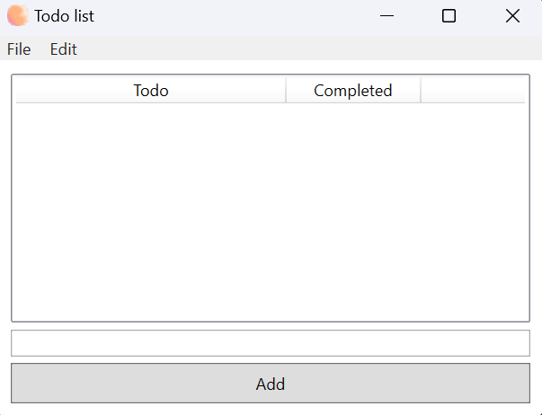

# WPF ToDoList Application

A simple ToDoList application built with WPF (Windows Presentation Foundation).

## Features

- Add, edit, and delete tasks.
- Mark tasks as complete.
- Save and load tasks from a local file.

## Getting Started

These instructions will help you get a copy of the project up and running on your local machine for development and testing purposes.

### Prerequisites

- Visual Studio (recommended version 2022)
- .NET Framework (version 6.0)

### Installing

1. Clone the repository to your local machine
